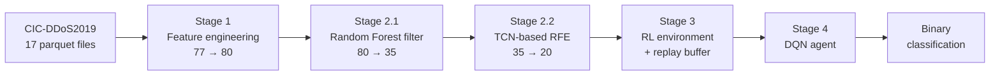

<div align="center">

# TRIDENT

**T**emporal **R**einforcement **I**ntrusion **D**etection **E**ngine for **N**etwork **T**raffic

A three-stage feature distillation pipeline feeding a Deep Q-Network that learns to classify DDoS traffic as a sequential decision problem.

[](https://python.org)
[](https://tensorflow.org)
[](https://www.unb.ca/cic/datasets/ddos-2019.html)
[](#results)
[](LICENSE)

</div>

---

## Results

Held-out test set, CIC-DDoS2019.

| Metric | Score |
|:---|:---:|
| **Accuracy** | 96.73% |
| **Precision** | **99.75%** |
| **Recall** | 96.05% |
| **F1** | 97.87% |

99.75% precision means roughly 1 false positive in 400 flagged flows. For an intrusion detection system that matters more than raw accuracy — analyst fatigue from false alarms is the failure mode that kills deployments.

> [!NOTE]
> Read [What actually drives the performance](#what-actually-drives-the-performance) before citing these numbers. The reinforcement learning component did not converge, and the honest reading is that the feature pipeline is doing most of the work.

---

## Pipeline



### Stage 1 — Feature engineering

Domain features constructed to expose DDoS-specific structure:

| Feature | Intuition |
|:---|:---|
| `IAT_Variance_Ratio` | Flow inter-arrival dispersion — automated floods are unnaturally regular |
| `IAT_Entropy_Approx` | Log-scaled timing irregularity |
| `Wavelet_Energy_L1/L2_Proxy` | Packet-length energy proxies |
| `Dominant_Freq_Proxy` | Flow rate as a frequency stand-in |
| `Protocol_Complexity` | Protocol weighted by log flow duration |
| `Direction_Asymmetry` | Normalised forward/backward header imbalance — the signature of reflection attacks |

### Stage 2.1 — Random Forest pre-filter

A 50-tree forest ranks all 80 features by impurity importance; the top 35 survive. Cheap, and it removes the obviously dead dimensions before anything expensive runs.

### Stage 2.2 — TCN-based recursive feature elimination

This is the interesting part. Rather than eliminating features by tree importance, TRIDENT trains a **Temporal Convolutional Network** and ranks features by **input-gradient saliency**:

```python
with tf.GradientTape() as tape:
    tape.watch(inputs)
    predictions = model(inputs)
    loss = predictions[:, 1]
grads = tape.gradient(loss, inputs)
feature_importance = np.mean(np.abs(grads.numpy()), axis=(0, 2))
```

The TCN uses four residual blocks with dilations 1, 2, 4, 8 — 64-filter causal convolutions, layer normalisation, and spatial dropout at 0.5. One feature is dropped per iteration and the network is retrained, running 35 → 20.

Gradient-based elimination asks *what does a temporal model actually depend on*, which is a different question from *what splits a tree well* — and a more appropriate one when the downstream model is a neural network.

**Final 20 features:** `Bwd Packets/s`, `Packet Length Min`, `Avg Packet Size`, `Down/Up Ratio`, `Bwd Packet Length Mean`, `Fwd Packet Length Min`, `Avg Bwd Segment Size`, `ACK Flag Count`, `URG Flag Count`, `Fwd Packets Length Total`, `Total Backward Packets`, `Flow IAT Mean`, `Avg Fwd Segment Size`, `Packet Length Mean`, `Subflow Bwd Packets`, `Fwd Packet Length Mean`, `Init Fwd Win Bytes`, `Protocol_Complexity`, `Bwd Packets Length Total`, `Fwd IAT Mean`

One engineered feature — `Protocol_Complexity` — survived elimination against 77 original features. That is the strongest evidence in the project that the feature engineering was worth doing.

### Stages 3–4 — Reinforcement learning

Classification is framed as an MDP: each flow is a state, each label a discrete action, correct classification earns +1 and errors −1. A DQN with a target network and a 50k-transition replay buffer learns the policy.

```
Conv1D(16) → BatchNorm → Conv1D(32) → BatchNorm → GlobalAveragePooling
  → Dense(128) → Dropout(0.3) → Dense(64) → Dropout(0.3) → Dense(64)
  → Dense(32) → Dropout(0.2) → Dense(16) → Dropout(0.2) → Dense(2, linear)
```

Huber loss, Adam with gradient clipping at 1.0, L2 regularisation throughout, ε-greedy exploration decaying at 0.995.

---

## What actually drives the performance

Reported openly, because the training log is in the notebook and anyone who reads it will see this.

**The DQN did not converge.** Episode rewards across 15 episodes:

```
58, -58, 66, 34, 46, 26, 58, 132, 116, 56, 194, 28, 90, 188, 24
```

That is not a learning curve — it is a random walk with a slight upward drift. Training stopped on the patience counter, not on convergence.

**The discount factor is γ = 0.01.** At that value future reward is almost entirely discounted, which collapses the MDP to independent per-sample decisions. TRIDENT is, in effect, running supervised classification through a Q-learning wrapper. Sequential credit assignment — the actual reason to use RL — is not happening.

**So where does 96.73% come from?** The three-stage feature pipeline. Twenty features selected by gradient saliency from a temporal model carry enough signal that the downstream network performs well almost regardless of how it is trained.

**Why publish it that way?** Because the feature distillation pipeline is genuinely useful and independently reusable, and because a negative result about the RL framing is worth more than a quiet omission. The next version either raises γ and gives the agent a genuinely sequential formulation — flow-window episodes, cost-sensitive rewards — or drops the RL wrapper and trains the TCN directly.

---

## Configuration

```python
CONFIG = {
    'SAMPLE_RATIO':   0.10,     # 10% stratified sample of each parquet
    'SEED':           42,
    'BATCH_SIZE':     128,
    'EPOCHS':         15,       # RL episodes
    'TARGET_FEATURES': 20,
    'GAMMA':          0.01,     # see note above
    'LEARNING_RATE':  0.001,
    'EPSILON_DECAY':  0.995,
    'MIN_EPSILON':    0.01,
    'L2_REG':         0.001,
    'PATIENCE':       8
}
```

**Data:** 17 Parquet files, 10% sample → 43,135 flows × 78 features. Class balance 77.8% attack / 22.2% benign.

**Hardware:** Tesla P100-PCIE-16GB with mixed-precision FP16.

---

## Getting started

```bash
git clone https://github.com/hackeradhii/trident-nids.git
cd trident-nids
pip install -r requirements.txt
```

Download [CIC-DDoS2019](https://www.unb.ca/cic/datasets/ddos-2019.html) and place the Parquet files under `data/cicddos2019/`, then:

```bash
jupyter notebook trident.ipynb
```


## License

MIT — see [LICENSE](LICENSE).

---

<div align="center">

Part of a series on machine learning for network security  
[WGT-Net](https://github.com/hackeradhii/wgt-net) · [WH-PhishNet](https://github.com/hackeradhii/wh-phisnet) · [CSDTab-ID](https://github.com/hackeradhii/csdtab-id)

</div>
